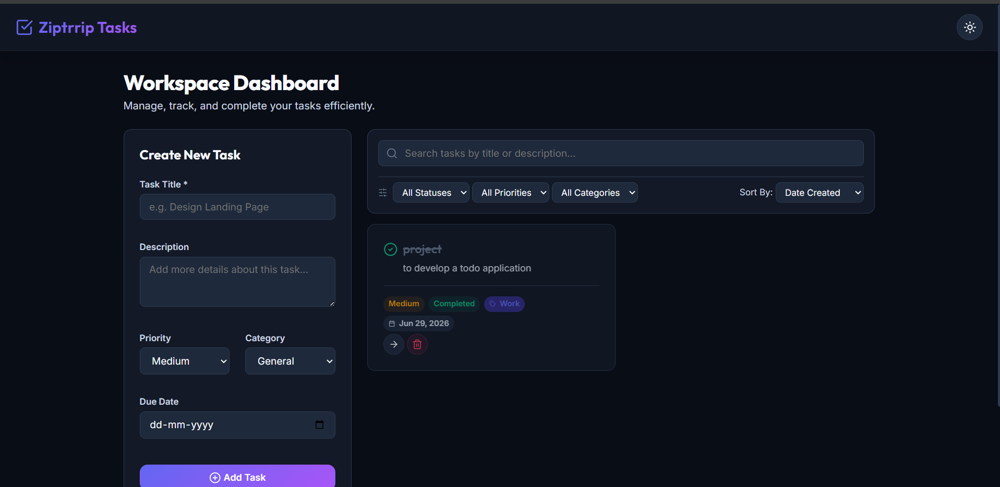
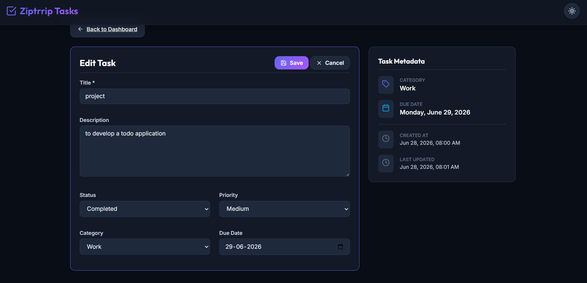
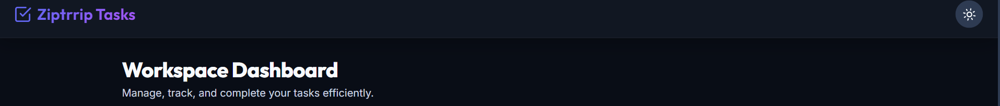

# Ziptrrip Tasks - Todo Application

A professional, feature-rich Todo Application built with **React (Vite)** on the frontend and **Node.js (Express)** on the backend. This application is designed as an assignment submission demonstrating solid architectural principles, clean code structure, and a premium visual aesthetic.

## Architecture Highlights
- **True Multi-Page Application (MPA)**: Fully complies with the assignment requirement *"multiple page instead of SPA"* by using Vite's multi-page entry point settings. It compiles two distinct, physical HTML pages: `index.html` (Todo List page) and `todo.html` (Todo Details page, using query parameters for the todo ID, e.g., `/todo.html?id=<id>`).
- **RESTful Node.js Backend**: Express.js server exposing clean CRUD APIs.
- **Robust Storage**: File-based storage (`backend/data/todos.json`) with safe read/write and directory generation.
- **Premium CSS System**: Responsive layouts, unified colors, glassmorphic headers, micro-animations, and persistent dark/light mode toggles without any third-party UI libraries (Vanilla CSS).

---

## Application Screenshots


### 1. Dashboard View (Todo List)


### 2. Task Details & Edit View


### 3. Dark Mode View


---

## Repository Structure
```text
Ziptrrip_todo/
├── backend/
│   ├── data/
│   │   └── todos.json          # File storage for todos data
│   ├── src/
│   │   ├── controllers/
│   │   │   └── todoController.js  # Request handler logic
│   │   ├── models/
│   │   │   └── todoModel.js       # JSON file repository helper
│   │   ├── routes/
│   │   │   └── todoRoutes.js      # REST endpoint definitions
│   │   └── server.js           # Server bootstrapper & middlewares
│   └── package.json
│
├── frontend/
│   ├── src/
│   │   ├── components/
│   │   │   ├── Layout.jsx      # Theme toggle and common header
│   │   │   ├── TodoCard.jsx    # Todo item card
│   │   │   └── TodoForm.jsx    # Create Todo form
│   │   ├── services/
│   │   │   └── api.js          # Axios API wrappers
│   │   ├── styles/
│   │   │   └── global.css      # Core premium design system
│   │   ├── list-main.jsx       # Entry script for index.html
│   │   ├── details-main.jsx    # Entry script for todo.html
│   │   ├── ListApp.jsx         # Todo List page logic
│   │   └── DetailsApp.jsx      # Todo Details page logic
│   ├── index.html              # Main dashboard entry
│   ├── todo.html               # Details entry
│   ├── vite.config.js          # Multi-Page setup config
│   └── package.json
│
├── screenshots/                # Folder containing interface screenshots
├── README.md                   # Project overview
├── FEATURES.md                 # Detailed feature documentation
├── API.md                      # Backend API endpoint reference
└── INSTALLATION.md             # How to install, run, and test locally
```

---

## Key Documentation Files
To satisfy the requirements of the assignment, all functionalities are documented in individual Markdown files in this repository:
1. **[FEATURES.md](file:///c:/Users/anbar/.antigravity/Ziptrrip_todo/FEATURES.md)**: Details the UX/UI features, sorting, filtering, priority flags, and detail pages.
2. **[API.md](file:///c:/Users/anbar/.antigravity/Ziptrrip_todo/API.md)**: REST API schema definitions, parameters, and sample payloads.
3. **[INSTALLATION.md](file:///c:/Users/anbar/.antigravity/Ziptrrip_todo/INSTALLATION.md)**: Step-by-step setup guides for backend, frontend, and concurrent running.

---

## Quick Start Guide

### 1. Start Backend Server
```bash
cd backend
npm install
npm run dev
# Server will run on http://localhost:5000
```

### 2. Start Frontend App
```bash
cd frontend
npm install
npm run dev
# Frontend will run on http://localhost:5173
```
Open [http://localhost:5173](http://localhost:5173) in your browser.
